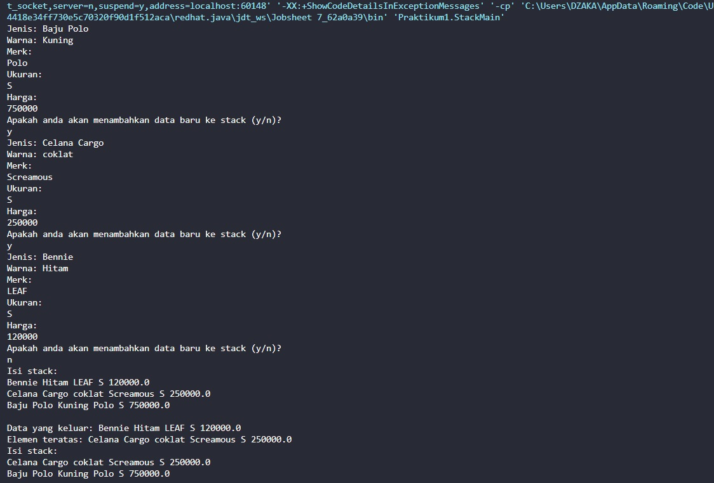

# JOBSHEET 7 : STACK
## NAMA : MUHAMMAD DZAKA MURRAN RUSID
## KELAS/ABS : 1F_D4-TI/18

### 7.1 Tujuan Praktikum
Setelah melakukan materi praktikum ini, mahasiswa mampu:
1. Mengenal struktur data Stack
2. Membuat dan mendeklarasikan struktur data Stack
3. Menerapkan algoritma Stack dengan menggunakan array
### 7.2 Praktikum 1
Waktu percobaan : 45 menit
Pada percobaan ini, kita akan membuat program yang mengilustrasikan tumpukan pakaian yang 
disimpan ke dalam stack. Karena sebuah pakaian mempunyai beberapa informasi, maka implementasi 
Stack dilakukan dengan menggunakan array of object untuk mewakili setiap elemennya.

#### 7.2.1 Langkah-langkah Percobaan
1. Perhatikan Diagram Class Pakaian berikut ini
2. Buat package dengan nama Praktikum1, kemudian buat class baru dengan nama Pakaian.
3. Tambahkan atribut-atribut Pakaian seperti pada Class Diagram Pakaian, kemudian tambahkan 
pula konstruktornya seperti gambar berikut ini.
4. Setelah membuat class Pakaian, selanjutnya perlu dibuat class Stack yang berisi atribut dan 
method sesuai diagram Class Stack berikut ini:
5. Buat class baru dengan nama Stack. Kemudian tambahkan atribut dan konstruktor seperti 
gambar berikut ini.
6. Buat method IsEmpty bertipe boolean yang digunakan untuk mengecek apakah stack kosong.
7. Buat method IsFull bertipe boolean yang digunakan untuk mengecek apakah stack sudah terisi 
penuh.
8. Buat method push bertipe void untuk menambahkan isi elemen stack dengan parameter pkn
yang berupa object Pakaian
9. Buat method Pop bertipe void untuk mengeluarkan isi elemen stack. Karena satu elemen stack
terdiri dari beberapa informasi (jenis, warna, merk, ukuran, dan harga), maka ketika mencetak 
data juga perlu ditampilkan semua informasi tersebut
10. Buat method peek bertipe void untuk memeriksa elemen stack pada posisi paling atas.
11. Buat method print bertipe void untuk menampilkan seluruh elemen pada stack.
12. Buat method clear bertipe void untuk menghapus seluruh isi stack.
13. Selanjutnya, buat class baru dengan nama StackMain. Buat fungsi main, kemudian lakukan 
instansiasi objek dari class Stack dengan nama stk dan nilai parameternya adalah 5.
14. Deklarasikan Scanner dengan nama sc
15. Tambahkan kode berikut ini untuk menerima input data Pakaian, kemudian semua informasi 
tersebut dimasukkan ke dalam stack
Catatan: sintaks sc.nextLine() sebelum sintaks st.push(p) digunakan untuk mengabaikan karakter 
new line
16. Lakukan pemanggilan method print, method pop, dan method peek dengan urutan sebagai 
berikut.
17. Compile dan jalankan class StackMain, kemudian amati hasilnya.

```java
package Praktikum1; //sc code pakaian.java
public class Pakaian{
    String jenis, warna, merk, ukuran;
    double harga;

    Pakaian(String jenis, String warna, String merk, String ukuran, double harga){
        this.jenis = jenis;
        this.warna = warna;
        this.merk = merk;
        this.ukuran = ukuran;
        this.harga = harga;
    }

}
```

```java
package Praktikum1;

public class Stack { //sc code Stack.java
    int size;
    int top;
    Pakaian data[];

    public Stack(int size){
        this.size = size;
        data = new Pakaian[size];
        top = -1;
    }

    public boolean isEmpty(){
        if (top==-1){
            return true;
        }else{
            return false;
        }
    }

    public boolean isFull(){
        if(top==size-1){
            return true;
        }else{
            return false;
        }
    }

    public void push(Pakaian pkn){
        if (!isFull()){
            top++;
            data[top] = pkn;
        }else{
            System.out.println("Isi stack penuh!!");
        }
    }

    public void pop(){
        if(!isEmpty()){
            Pakaian x = data[top];
            top--;
            System.out.println("Data yang keluar: " + x.jenis + " " + x.warna + " " + x.merk + " " + x.ukuran + " " + x.harga);
        }else{
            System.out.println("Stack masih kosong");
        }
    }

    public void peek(){
        System.out.println("Elemen teratas: " + data[top].jenis + " " + data[top].warna + " " + data[top].merk + " " + data[top].ukuran + " " + data[top].harga);
    }

    public void print(){
        System.out.println("Isi stack: ");
        for (int i=top;i>=0;i--){
            System.out.println(data[i].jenis + " " + data[i].warna + " " + data[i].merk + " " + data[i].ukuran + " " + data[i].harga + " ");
        }
    System.out.println("");
    }

    public void clear(){
        if(!IsEmpty()){
            for(int i=top;i>=0;i--){
                top--;
            }
        System.out.println("Stack sudah dikosongkan");
        }else{
            System.out.println("Stack masih kosong");
        }
    }
}
```

```java
package Praktikum1; //sc code praktikum1.java
import java.util.Scanner;
public class StackMain {
    public static void main(String[] args){
    Stack stk = new Stack(5);
    Scanner sc = new Scanner(System.in);
    
    char pilih;
    do{
        System.out.print("Jenis: ");
        String jenis = sc.nextLine();
        System.out.print("Warna: ");
        String warna = sc.nextLine();
        System.out.println("Merk: ");
        String merk = sc.nextLine();
        System.out.println("Ukuran: ");
        String ukuran = sc.nextLine();
        System.out.println("Harga: ");
        double harga = sc.nextDouble();

        Pakaian p = new Pakaian(jenis, warna, merk, ukuran, harga);
        System.out.println("Apakah anda akan menambahkan data baru ke stack (y/n)?");
        pilih = sc.next().charAt(0);
        sc.nextLine();
        stk.push(p);
    }while (pilih == 'y');

    stk.print();
    stk.pop();
    stk.peek();
    stk.print();

    }
}
```
#### 7.2.2 Verifikasi Hasil Percobaan


#### 7.2.3 Pertanyaan
1. Berapa banyak data pakaian yang dapat ditampung di dalam stack? Tunjukkan potongan kode 
program untuk mendukung jawaban Anda tersebut!
<br> 

**Jawaban**
```java
 public Stack(int size){
        this.size = size;
        data = new Pakaian[size];
        top = -1;
    }

    public boolean isEmpty(){
        if (top==-1){
            return true;
        }else{
            return false;
        }
    }

    public boolean isFull(){
        if(top==size-1){
            return true;
        }else{
            return false;
        }
    }
```
Banyak data yang bisa ditampung dalam satu stack tersebut adalah top-1, jadi selebihnya dari itu akan terjadi isFull.
<br>
2. Perhatikan class StackMain, pada saat memanggil fungsi push, parameter yang dikirimkan adalah p. Data apa yang tersimpan pada variabel p tersebut?
<br>

**Jawaban: data yang tersimpan adalah jenis, warna, merk, ukuran, harga**

<br>
3. Apakah fungsi penggunaan do-while yang terdapat pada class StackMain?

**Jawaban: do-while di class StackMain digunakan untuk melakukan perintah  looping terlebih dahulu sebelum mengecek kondisi, sehingga perintah didalam do-while masih berjalan walau kondisinya salah.**
<br>
4. Modifikasi kode program pada class StackMain sehingga pengguna dapat memilih operasi-operasi pada stack (push, pop, peek, atau print) melalui pilihan menu program dengan 
memanfaatkan kondisi IF-ELSE atau SWITCH-CASE!
<br>

**Jawaban**
```java 
System.out.println("Masukkan pilihan yang anda ingin lakukan terhadap stack: ");
    System.out.println("Pilihan: print, pop, peek");
    String opsi = sc.nextLine();

    if(opsi.equalsIgnoreCase("print")){
        stk.print();
    }else if(opsi.equalsIgnoreCase("pop")){
        stk.pop();
    }else if(opsi.equalsIgnoreCase("peek")){
        stk.peek();
    }else if(opsi.equalsIgnoreCase("print")){
        stk.print();
    } 
```


### 7.3 Praktikum 2
Waktu percobaan : 30 menit
Pada percobaan ini, kita akan membuat program untuk melakukan konversi notasi infix menjadi 
notasi postfix.

#### 7.3.1 Langkah-langkah Percobaan
1. Perhatikan Diagram Class berikut ini:
Postfix
n: int
top: int
stack: char[]
Postfix(total: int)
push(c: char): void
pop(): void
IsOperand(c: char): boolean
IsOperator(c: char): boolean
derajat(c: char): int
konversi(Q: String): string
Berdasarkan diagram class tersebut, akan dibuat program class Postfix dalam Java.
2. Buat package dengan nama Praktikum2, kemudian buat class baru dengan nama Postfix. 
Tambahkan atribut n, top, dan stack sesuai diagram class Postfix tersebut.
3. Tambahkan pula konstruktor berparameter seperti gambar berikut ini.
4. Buat method push dan pop bertipe void.
5. Buat method IsOperand dengan tipe boolean yang digunakan untuk mengecek apakah elemen 
data berupa operand.
6. Buat method IsOperator dengan tipe boolean yang digunakan untuk mengecek apakah elemen 
data berupa operator.
7. Buat method derajat yang mempunyai nilai kembalian integer untuk menentukan derajat 
operator.
8. Buat method konversi untuk melakukan konversi notasi infix menjadi notasi postfix dengan cara 
mengecek satu persatu elemen data pada String Q sebagai parameter masukan.
9. Selanjutnya, buat class baru dengan nama PostfixMain tetap pada package Praktikum2. Buat 
class main, kemudian buat variabel P dan Q. Variabel P digunakan untuk menyimpan hasil akhir 
notasi postfix setelah dikonversi, sedangkan variabel Q digunakan untuk menyimpan masukan 
dari pengguna berupa ekspresi matematika dengan notasi infix. Deklarasikan variabel Scanner 
dengan nama sc, kemudian panggil fungsi built-in trim yang digunakan untuk menghapus adanya 
spasi di depan atau di belakang teks dari teks persamaan yang dimasukkan oleh pengguna.
Penambahan string “)” digunakan untuk memastikan semua simbol/karakter yang masih berada 
di stack setelah semua persamaan terbaca, akan dikeluarkan dan dipindahkan ke postfix.
10. Buat variabel total untuk menghitung banyaknya karaketer pada variabel Q.
11. Lakukan instansiasi objek dengan nama post dan nilai parameternya adalah total. Kemudian 
panggil method konversi untuk melakukan konversi notasi infix Q menjadi notasi postfix P.
12. Compile dan jalankan class PostfixMain dan amati hasilnya.
```java
package Praktikum1;
public class Postfix { //class Postfix.java

    int n;
    int top;
    char stack[];

    public Postfix(int total){
        n = total;
        top = -1;
        stack = new char[n];
        push('(');
    }

    public void push(char c){
        top++;
        stack[top] = c;
    }

    public char pop(){
        char item = stack[top];
        top--;
        return item;
    }

    public boolean isOperand(char c){
        if((c >= 'A' && c <= 'Z') || (c >= 'a' && c <= 'z') || (c >= '0' && c <= '9') || c == ' ' || c == '.') {

            return true;
        } else {
            return false;
        }
    }

    public boolean isOperator(char c){
        if(c == '^' || c == '%' || c == '/' || c == '*' || c == '-' || c == '+') {
            return true;
        }else{
            return false;
        }
    }

    public int derajat(char c){
        switch (c){
            case '^':
                return 3;
            case '%':
                return 2;
            case '/':
                return 2;
            case '*':
                return 2;
            case '-':
                return 1;
            case '+':
                return 1;
            default:
                return 0;
        }
    }

    public String konversi(String Q){
        String P = "";
        char c;
        for(int i = 0; i < n; i++){
            c = Q.charAt(i);
            if(isOperand(c)){
                P = P + c;
            }
            if(c == '('){
                push(c);
            }
            if(c == ')'){
                while (stack[top] != '('){
                    P = P + pop();
                }
                pop();
            }
            if(isOperator(c)) {
                while (derajat(stack[top]) >= derajat(c)){
                    P = P + pop();
                }
                push(c);
            }
        }
        return P;
    }
}

package Praktikum1; //main class postfixmain.java
import java.util.Scanner;

public class PostfixMain {

    public static void main(String[] args) {
        Scanner sc = new Scanner(System.in);
        String P, Q;
        System.out.println("Masukkan ekspresi matematika (infix): ");
        Q = sc.nextLine();
        Q = Q.trim();
        Q = Q + ")";

        int total = Q.length();

        Postfix post = new Postfix(total);
        P = post.konversi(Q);
        System.out.println("Postfix: " + P);
        sc.close();
    }
}
```

#### 7.3.2 Verifikasi Hasil Percobaan


#### 7.3.3 Pertanyaan
1. Perhatikan class Postfix, jelaskan alur kerja method derajat!
<br>

**Jawaban: Method derajat yang merupakan looping berbentuk switch and case memiliki alur kerja tingkatan, jadi apabila tanda operasi berbentuk ^ maka akan masuk ke tingkat tertinggi (3), kemudian apabila tanda operasi berbentuk /, (tanda bintang) dan % maka akan masuk ke tingkat kedua (2), kemudian apabila tanda operasi berbentuk + dan - maka akan masuk ke tingkat kesatu/yang terendah kemudian jika tidak seluruh logo tersebut maka termasuk ke default atau 0 yang berarti tidak masuk tingkat manapun.**


2. Apa fungsi kode program berikut?
<br>

**Jawaban: Variabel c digunakan untuk menyimpan data char i ke dalam variabel Q dengan menggunakan perintah charAt(i).**

3. Jalankan kembali program tersebut, masukkan ekspresi 3*5^(8-6)%3. Tampilkan hasilnya!
<br>

**Jawaban**

4. Pada soal nomor 3, mengapa tanda kurung tidak ditampilkan pada hasil konversi? Jelaskan!
<br>

**Jawaban: Karena pada method IsOperator tidak didefinisikan tanda kurung sebagai bagian dari operator, sehingga program tidak membaca dan membiarkan tanda kurung setelah mengkonversi dari infix ke postfix.**

### 7.4 Tugas
1. Perhatikan dan gunakan kembali kode program pada Praktikum 1. Tambahkan method getMin
pada class Stack yang digunakan untuk mencari dan menampilkan data pakaian dengan harga 
terendah dari semua data pakaian yang tersimpan di dalam stack!
<br>

**Jawaban**
<br>
SC StrukBelanja.java

```java
package Tugas;

public class PakaianTugas { 
    String tanggal, namaBarang;
    int noTransaksi, jmlh, total;

    StrukBelanja(int nt, String tgl, String nb, int j, int t) {
        noTransaksi = nt;
        tanggal = tgl;
        namaBarang = nb;
        jmlh = j;
        total = t;
    }
}
```

SC StackTugas.java
```java
package Tugas;

public class StackTugas {
    int size;
    int top;
    PakaianTugas data[];

    public StackTugas(int size) {
        this.size = size;
        data = new PakaianTugas[size];
        top = -1;
    }

    public boolean IsEmpty() {
        if (top == -1) {
            return true;
        } else {
            return false;
        }
    }

    public boolean IsFull() {
        if (top == size - 1) {
            return true;
        } else {
            return false;
        }
    }

    public void push(PakaianTugas pkn) {
        if (!IsFull()) {
            top++;
            data[top] = pkn;
        } else {
            System.out.println("Isi stack penuh!");
        }
    }

    public void pop() {
        if (!IsEmpty()) {
            PakaianTugas x = data[top];
            top--;
            System.out.println(
                    "Data yang keluar: " + x.jenis + " " + x.warna + " " + x.merk + " " + x.ukuran + " " + x.harga);
        } else {
            System.out.println("Stack masih kosong");
        }
    }

    public void peek() {
        System.out.println("Elemen teratas: " + data[top].jenis + " " + data[top].warna + " " + data[top].merk + " "
                + data[top].ukuran + " " + data[top].harga);
    }

    public void print() {
        System.out.println("Isi stack: ");
        for (int i = top; i >= 0; i--) {
            System.out.println(data[i].jenis + " " + data[i].warna + " " + data[i].merk + " " + data[i].ukuran + " "
                    + data[i].harga + " ");
        }
        System.out.println("");
    }

    public void clear() {
        if (!IsEmpty()) {
            for (int i = top; i >= 0; i--) {
                top--;
            }
            System.out.println("Stack sudah dikosongkan");
        } else {
            System.out.println("Stack masih kosong");
        }
    }

    public void getMin() {
        double hrgMin = data[0].harga;
        int idn = 0;
        for (int i = 1; i <= top; i++) {
            if (hrgMin > data[i].harga) {
                idn = i;
                hrgMin = data[i].harga;
            }
        }
        System.out.println("Harga Pakaian Terendah adalah\t: " + data[idn].harga);
        System.out.println("Dengan merk\t\t\t: " + data[idn].merk);
    }
}
```

SC StackMainTugas.java
```java
package Tugas;

import java.util.Scanner;

public class StackMainTugas {
    public static void main(String[] args) {
        StackTugas stk = new StackTugas(5);

        Scanner sc = new Scanner(System.in);
        Scanner sd = new Scanner(System.in);

        char pilih;
        do {
            System.out.println("------------------------------------");
            System.out.println("             PILIHAN MENU           ");
            System.out.println("------------------------------------");
            System.out.println(" 1. Push\n 2. Pop\n 3. Peek\n 4. Print\n 5. Harga Terendah\n");
            int pilihan;
            System.out.print("Pilih Menu (masukkan angka 1-4): ");
            pilihan = sd.nextInt();

            switch (pilihan) {
                case 1:
                    do {
                        System.out.print("Jenis\t\t: ");
                        String jenis = sc.nextLine();
                        System.out.print("Warna\t\t: ");
                        String warna = sc.nextLine();
                        System.out.print("Merk\t\t: ");
                        String merk = sc.nextLine();
                        System.out.print("Ukuran\t\t: ");
                        String ukuran = sc.nextLine();
                        System.out.print("Harga\t\t: ");
                        double harga = sd.nextInt();
                        System.out.println("");

                        PakaianTugas p = new PakaianTugas(jenis, warna, merk, ukuran, harga);
                        System.out.print("Apakah anda akan menambahkan data baru ke stack (y/n)? ");
                        pilih = sc.next().charAt(0);
                        sc.nextLine();
                        stk.push(p);
                    } while (pilih == 'y');
                    break;

                case 2:
                    stk.pop();
                    break;

                case 3:
                    stk.peek();
                    break;

                case 4:
                    stk.print();
                    break;

                case 5:
                    stk.getMin();
                    break;

                default:
                    System.out.println("Input yang anda masukkan salah");
                    System.exit(0);
            }
            if (pilihan == 5) {
                pilih = 't';
            } else {
                System.out.print("Kembali ke menu Utama (y/t) ");
                pilih = sc.next().charAt(0);
            }
        } while (pilih == 'y');

        sc.close();
        sd.close();
    }
}
```

**OUTPUT**


2. Setiap hari Minggu, Dewi pergi berbelanja ke salah satu supermarket yang berada di area 
rumahnya. Setiap kali selesai berbelanja, Dewi menyimpan struk belanjaannya di dalam laci. 
Setelah dua bulan, ternyata Dewi sudah mempunyai delapan struk belanja. Dewi berencana 
mengambil lima struk belanja untuk ditukarkan dengan voucher belanja.
Buat sebuah program stack untuk menyimpan data struk belanja Dewi, kemudian lakukan juga 
proses pengambilan data struk belanja sesuai dengan jumlah struk yang akan ditukarkan dengan 
voucher. Informasi yang tersimpan pada struk belanja terdiri dari:
 Nomor transaksi
 Tanggal pembelian
 Jumlah barang yang dibeli
 Total harga bayar
Tampilkan informasi struk belanja yang masih tersimpan di dalam stack
<br>

**Jawaban**

SC StrukBelanja.java
```java
package Tugas;

public class StrukBelanja {
    String tanggal, namaBarang;
    int noTransaksi, jmlh, total;

    StrukBelanja(int nt, String tgl, String nb, int j, int t) {
        noTransaksi = nt;
        tanggal = tgl;
        namaBarang = nb;
        jmlh = j;
        total = t;
    }
}
```

SC Belanja.java
```java
package Tugas;

public class Belanja {
    int size;
    int top;
    StrukBelanja data[];

    public Belanja(int size) {
        this.size = size;
        data = new StrukBelanja[size];
        top = -1;
    }

    public boolean IsEmpty() {
        if (top == -1) {
            return true;
        } else {
            return false;
        }
    }

    public boolean IsFull() {
        if (top == size - 1) {
            return true;
        } else {
            return false;
        }
    }

    public void push(StrukBelanja sb) {
        if (!IsFull()) {
            top++;
            data[top] = sb;
        } else {
            System.out.println("Isi stack penuh!");
        }
    }

    public void pop() {
        if (!IsEmpty()) {
            StrukBelanja x = data[top];
            top--;
            System.out.println("Data yang keluar: " + x.noTransaksi + " " + x.tanggal + " " + x.namaBarang + " "
                    + x.jmlh + " " + x.total);
        } else {
            System.out.println("Stock masih kosong");
        }
    }

    public void peek() {
        System.out.println("Elemen teratas: " + data[top].noTransaksi + "." + " " + data[top].tanggal + " "
                + data[top].namaBarang + " " + data[top].jmlh + " " + data[top].total);
    }

    public void print() {
        System.out.println("Isi stack: ");
        for (int i = top; i >= 0; i--) {
            System.out.println(data[i].noTransaksi + " " + data[i].tanggal + " " + data[i].namaBarang + " "
                    + data[i].jmlh + " " + data[i].total);
        }
        System.out.println("");
    }

    public void clear() {
        if (!IsEmpty()) {
            for (int i = top; i >= 0; i--) {
                top--;
            }
            System.out.println("Stock sudah dikosongkan");
        } else {
            System.out.println("Stock masih kosong");
        }
    }
}
```

SC StrukBelanjaMain.java
```java
package Tugas;

import java.util.Scanner;

public class StrukBelanjaMain {
    public static void main(String[] args) {
        Scanner sc = new Scanner(System.in);
        Scanner sd = new Scanner(System.in);

        System.out.println("----------------------------------");
        System.out.println("      History Struk Belanja       ");
        System.out.println("----------------------------------");
        System.out.println();
        System.out.print("Masukkan Banyak Struk\t: ");
        int banyak = sc.nextInt();
        System.out.println();
        Belanja blj = new Belanja(banyak);

        int totalHarga = 0;
        int jml, harga;
        for (int i = 0; i < banyak; i++) {
            System.out.print("Nomor Transaksi\t\t: ");
            int nt = sc.nextInt();
            System.out.print("Tanggal Pembelian\t: ");
            String tanggal = sd.nextLine();
            System.out.print("Nama Barang\t\t: ");
            String nb = sd.nextLine();
            System.out.print("Jumlah Barang\t\t: ");
            jml = sc.nextInt();
            System.out.print("Harga Barang\t\t: ");
            harga = sc.nextInt();
            totalHarga = jml * harga;
            StrukBelanja sb = new StrukBelanja(nt, tanggal, nb, jml, harga);
            blj.push(sb);
            System.out.print("Total Harga\t\t: " + totalHarga);
            System.out.println("\n");
        }

        char pilih;
        do {
            System.out.println("------------------------------------");
            System.out.println("             PILIHAN MENU           ");
            System.out.println("------------------------------------");
            System.out.println(
                    " 1. menampilkan struk teratas\n 2. ambil 5 struk untuk mendapatkan kupon\n 3. lihat sisa struk\n 4. keluar\n");

            System.out.print("Pilih Menu (masukkan angka 1-4)");
            int pilihan = sc.nextInt();
            System.out.println("------------------------------------------------");

            switch (pilihan) {
                case 1:
                    blj.peek();
                    blj.print();
                    break;
                case 2:
                    blj.pop();
                    blj.pop();
                    blj.pop();
                    blj.pop();
                    blj.pop();
                    break;
                case 3:
                    blj.print();
                    break;
                case 4:
                    System.out.println("Terima Kasih");
                    break;
                default:
                    System.out.println("Menu yang anda masukkan salah");
                    break;
            }
            if (pilihan == 4) {
                pilih = 't';
            } else {
                System.out.print("Kembali ke menu Utama (y/t) : ");
                pilih = sc.next().charAt(0);
            }
        } while (pilih == 'y');

        sc.close();
        sd.close();
    }
}
```

**OUTPUT**


